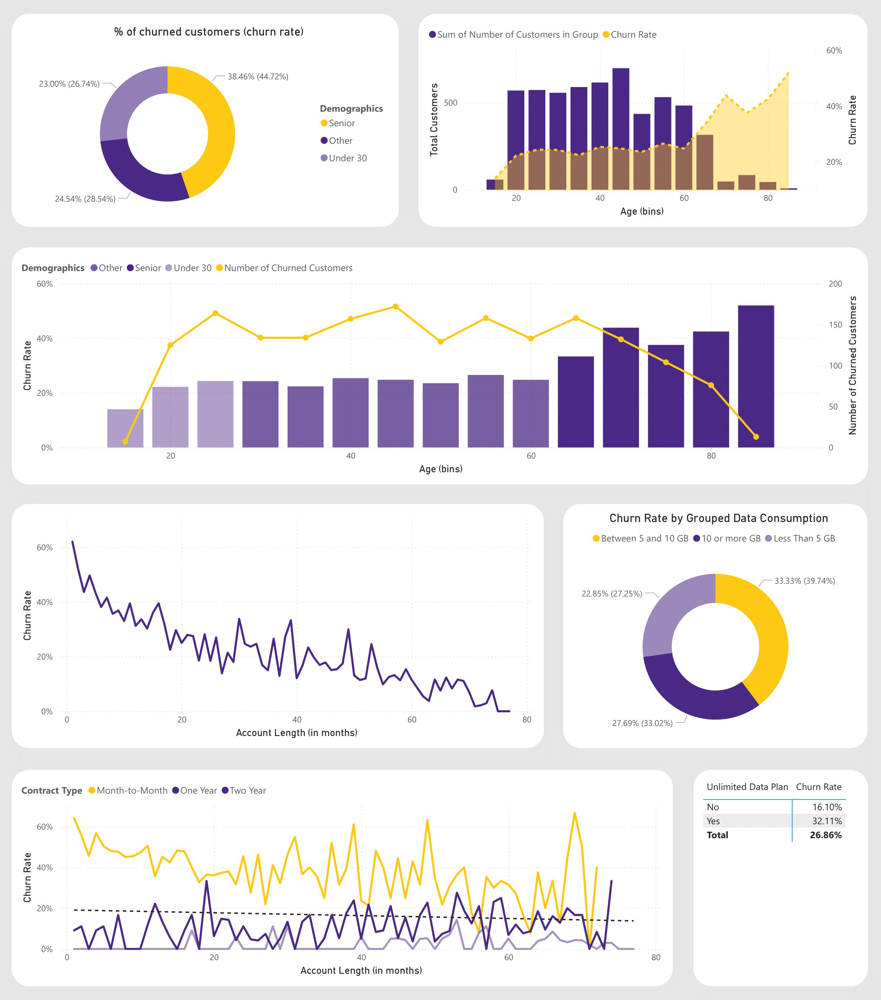

  

---

# 📊 Databel Customer Churn Analysis (Power BI Project)

### Author: **Mayur Mantri**
**Tool:** Microsoft Power BI  
**Focus:** Telecom Customer Retention Analytics  
**Dataset:** Databel Telecom Customer Data  

---

## 🧭 Project Introduction
This Power BI case study investigates customer churn at **Databel** and turns operational data across contracts, tenure, usage and charges, service interactions, demographics, and geography into a clear retention plan.  

It answers five executive questions: why customers leave, who is most at risk, where churn concentrates, how pricing and usage affect churn, and which operational signals enable prevention.  

The findings support targeted actions including competitor match offers, saves for early tenure and unlimited users, contract migration with meaningful benefits, and geo specific interventions to reduce churn while protecting ARPU and improving customer experience.

---

## 📌 Key Metrics

| Metric | Value |
|--------|--------|
| **Total Customers** | 6,687 |
| **Churned Customers** | 1,796 |
| **Overall Churn Rate** | 26.86% |

---

## 🧩 Business Questions & Insights

### **1️⃣ What are the primary drivers of churn?**
**Insight:**  
“Competitor made better offer” is the leading reason (≈45% of churn), followed by device/offer gaps and service attitude issues.  

**Action:**  
Reinforce competitive pricing and enhance service training for retention.  

**Visuals:**  
  

---

### **2️⃣ Who is most at risk of churn?**
**Insight:**  
Month-to-Month contracts, early-tenure customers, seniors, and heavy/unlimited data users show the highest churn rates.  

**Action:**  
Focus retention programs on these cohorts through targeted offers and proactive engagement.  

**Visuals:**  
  

---

### **3️⃣ Where is churn concentrated geographically?**
**Insight:**  
Churn is uneven across states; **California** shows an outlier churn rate of **63.24%**.  

**Action:**  
Run market-specific diagnostics and localised retention offers starting with high-churn regions.  

**Visuals:**  

---

### **4️⃣ How do pricing and usage relate to churn?**
**Insight:**  
Customers using **5–10 GB** or **10+ GB** churn more often than <5 GB users. **Unlimited plan users** churn twice as much (32% vs 16%).  

**Action:**  
Introduce fair-use bundles and proactive alerts to improve perceived value and prevent bill shock.  

**Visuals:**  
  

---

### **5️⃣ Which operational signals predict churn?**
**Insight:**  
Churners make more service calls and are more likely to pay manually (paper checks, credit card).  

**Action:**  
Use customer service call spikes and payment patterns as early churn predictors for save-team intervention.  

**Visuals:**  
  

---

## 🧮 Tools & Methods

- **Power BI Desktop** – Dashboard creation, DAX measures, KPI cards, and custom visuals  
- **Data Modelling** – Customers, contracts, charges, calls, and demographics  
- **Visualization Techniques** – Interactive slicers, color-coded KPIs, trend lines, and map visuals

