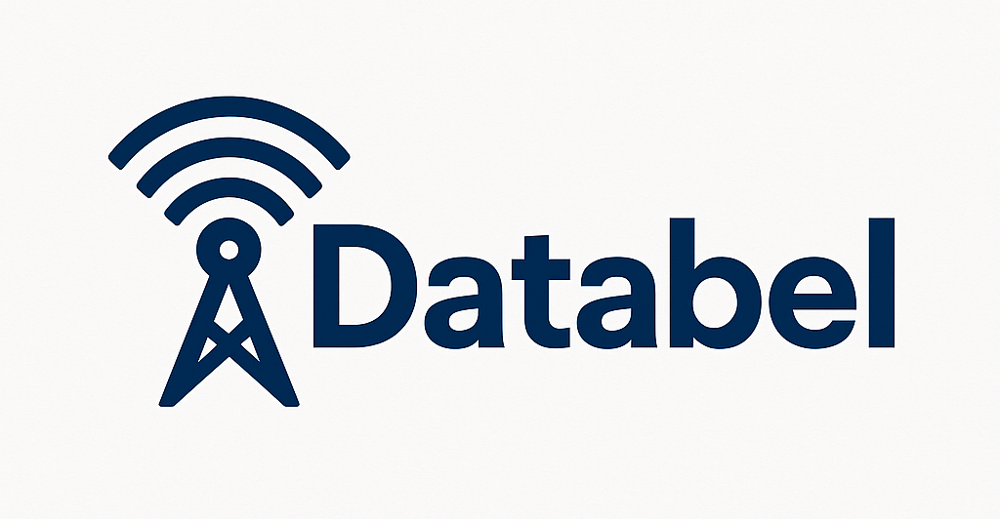
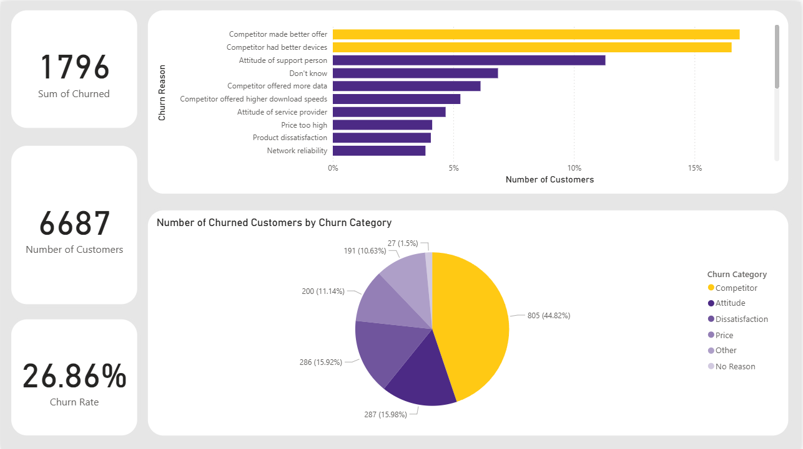

  

---

# 📊 Databel Customer Churn Analysis (Power BI Project)

### Author: **Mayur Mantri**
**Tool:** Microsoft Power BI  
**Focus:** Telecom Customer Retention Analytics  
**Dataset:** Databel Telecom Customer Data  

---

## 🧭 Project Introduction
This Power BI case study investigates customer churn at **Databel** and turns operational data across contracts, tenure, usage and charges, service interactions, demographics, and geography into a clear retention plan.  

It answers five executive questions: why customers leave, who is most at risk, where churn concentrates, how pricing and usage affect churn, and which operational signals enable prevention.  

The findings support targeted actions including competitor match offers, saves for early tenure and unlimited users, contract migration with meaningful benefits, and geo specific interventions to reduce churn while protecting ARPU and improving customer experience.

---

## 📌 Key Metrics

| Metric | Value |
|--------|--------|
| **Total Customers** | 6,687 |
| **Churned Customers** | 1,796 |
| **Overall Churn Rate** | 26.86% |

---

## 🧩 Business Questions & Insights

### **1️⃣ What are the primary drivers of churn?**

 
 
**Insight:**  
The analysis reveals that competitive pressure is the single largest cause of churn. Nearly 45% of customers who left Databel cited “Competitor made better offer” as their main reason, followed by better devices and negative service experiences. This indicates that customers perceive Databel’s value proposition and service responsiveness as weaker compared to rival telecom providers. Dissatisfaction with price and network reliability also appear as contributing factors, though secondary in magnitude. 

**Action:**  
Databel should reassess its competitive positioning by monitoring rival offers and designing personalised retention bundles for price-sensitive customers. Introducing device upgrade programs, loyalty discounts, and improved frontline support training will address both price and service attitude issues. Marketing communications should highlight Databel’s differentiators, such as network reliability, flexibility, and customer-first values.

**Visuals:**  
  

---

### **2️⃣ Who is most at risk of churn?**
**Insight:**  
Month-to-Month customers experience churn rates between 40% and 60%, far higher than One-Year (≈12%) or Two-Year (≈0–5%) contracts. Senior customers record the highest demographic churn (~38%), and new customers (low account tenure) leave at a faster pace. Additionally, unlimited and high-usage customers (5–10 GB and 10+ GB) show above-average churn, possibly due to price dissatisfaction or unclear value for unlimited data.

**Action:**  
Target these high-risk segments through personalised retention campaigns. Offer incentives for contract upgrades (e.g., free months or device credits) and loyalty programs for early-tenure users. Develop senior-friendly support options, such as simplified billing and responsive service teams. For heavy users, clearly communicate benefits of unlimited plans and add bonus features to reinforce value.

**Visuals:**  
  

---

### **3️⃣ Where is churn concentrated geographically?**
**Insight:**  
The geographical analysis highlights California as a major outlier with a churn rate exceeding 63%, significantly above the national average. Other Western and Southern U.S. states also show elevated churn clusters. This pattern suggests regional competitive pressures, network reliability issues, or localized service dissatisfaction rather than a uniform nationwide problem.

**Action:**  
Databel should adopt a geo-targeted retention approach. Begin with California by assessing competitor pricing, coverage quality, and service performance in that region. Launch localised offers, deploy additional customer service resources, and gather feedback through regional satisfaction surveys. Building regional churn dashboards will help track interventions and identify similar high-risk areas.

**Visuals:**  

---

### **4️⃣ How do pricing and usage relate to churn?**
**Insight:**  
Customers consuming higher data volumes churn more frequently. Both 5–10 GB and 10+ GB usage groups display 30%+ churn, compared to <20% among light users. Interestingly, customers with Unlimited Data Plans churn almost twice as often (32%) as those without (16%). This may point to unmet expectations in unlimited plan value or hidden costs (e.g., throttling or extra international charges). Additionally, average international and data overage fees are noticeably high.  

**Action:**  
Revisit pricing structures for heavy users to improve perceived fairness. Introduce transparent usage alerts, fair-use limits, and loyalty data bonuses. For unlimited plan subscribers, redefine plan tiers to include tangible perks like roaming, streaming credits, or speed boosts. Simplifying plan communication and proactively managing overage charges will reduce dissatisfaction-driven churn. 

**Visuals:**  
  

---

### **5️⃣ Which operational signals predict churn?**
**Insight:**  
Churned customers typically contact customer service more frequently, indicating dissatisfaction prior to departure. The analysis also shows correlations between churn and payment method patterns—manual payment users (credit card, paper check) show higher churn than Direct Debit users. These operational touchpoints serve as leading indicators of potential churn, especially when combined with early tenure or contract type.

**Action:**  
Databel can leverage these findings to predict churn in real time. Implement a retention alert system within the CRM that flags customers with multiple service calls or recent billing issues. Train save teams to respond with empathetic communication and tailored offers. Promote Direct Debit enrolment through incentives to reduce billing friction and improve retention stability.

**Visuals:**  
  

---

## 🧮 Tools & Methods

- **Power BI Desktop** – Dashboard creation, DAX measures, KPI cards, and custom visuals  
- **Data Modelling** – Customers, contracts, charges, calls, and demographics  
- **Visualization Techniques** – Interactive slicers, color-coded KPIs, trend lines, and map visuals

